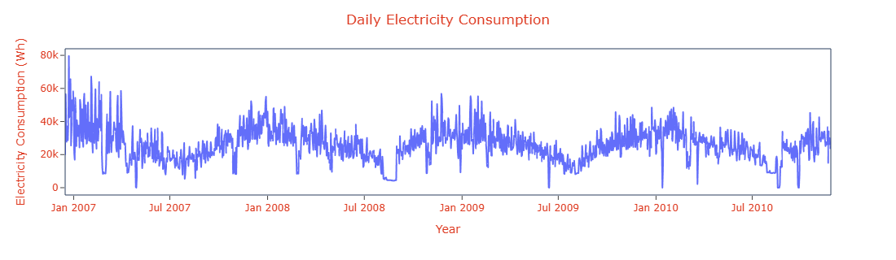
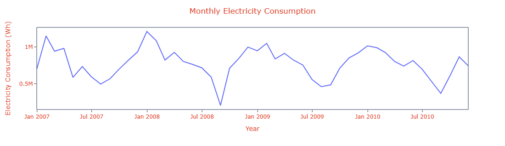

# 📑 Final Report: Energy Consumption Forecasting & Anomaly Detection

---

## 📌 Executive Summary  
This project analyzed historical household energy consumption to identify trends, detect seasonality, forecast future usage, and flag anomalous days. Multiple models were compared, and an interactive Tableau dashboard was created for visualization and business insights.

---

## 📌 Project Overview  
Understand consumption patterns, forecast future demand, detect anomalies, and assist operational planning through data-driven insights.

---

## 📌 Data Description  
- **Source:** [UCI Machine Learning Repository - Household Power Consumption Dataset](https://archive.ics.uci.edu/ml/datasets/individual+household+electric+power+consumption)
- **Granularity:** Minute-level readings aggregated to daily  
- **Key Variables:**  
  - `Date`  
  - `Global_active_power` (kW, minute-averaged)  
  - `voltage`
  - `sub-metering values`

---

## 📌 Data Preprocessing  
- Handled missing values by dropping them as only 1.25% missing values present  
- Generated time features for modeling  
- Calculated Daily Demand (kW) considering peaks of `Global_active_power`  
- Aggregated data to daily totals to get Daily Electricity Consumption (kWh)  

---

## 📌 Exploratory Data Analysis (EDA)  
- Original Time series plot to explore trends and seasonality  
- Observed strong monthly and moderate yearly seasonality  

	

		
	

 
- Higher consumption in winter (Jan–Feb and Nov-Dec)  
- Lower in summer (Jun–Aug)  
- Monthly cyclic pattern clear  

	

		
	

- Residuals post-modeling showed no patterns, indicating good seasonality capture  

---

## 📌 Visualizations  
- Daily demand & consumption time series  
- Decomposition Result: Level, Trend, Seasonality, Noise  
- ACF/PACF for SARIMAX tuning  
- Forecast vs Actual plots  
- Anomaly points on forecast graph

---

## 📌 Time Series Forecasting  

### SARIMAX  
- Best model: `(8, 0, 0)(1, 0, 1, 30)`  
- Forecasted daily consumption for one year  

### Prophet  
- Detected yearly and monthly seasonality automatically  
- Faster and more accurate with minimal tuning  

---

## 📌 Model Performance  

| Metric | SARIMAX | Prophet |
|:--------|:-----------|:----------|
| **MAE**  | 22.13      | 8.41      |
| **MAPE** | 61177632153903.7969 | 1835243223510714.2500 |
| **MSE**  | 555.24     | 107.37    |
| **RMSE** | 23.56      | 10.36     |

**Insight:** Prophet consistently outperformed SARIMAX on all metrics.

---

## 📌 Anomaly Detection  
- Used Z-Score method on residuals  
- |Z| > 3 flagged as anomalies  
- Example anomalous dates:  
    - `2006-12-23`
    - `2006-12-26`
    - `2007-02-03`

---

## 📌 Key Insights  

- **Peak Usage Trends:** Higher demand in winter, lower in summer  
- **Seasonal Dependencies:** Yearly and monthly seasonality confirmed  
- **Abnormal Demand Days:** Several flagged via anomaly detection  

---

## 📌 Dashboard & Interactive Visualization  

- Developed in Tableau  
- Time series plots, model metrics, anomaly visuals  
- Interactive parameter for toggling SARIMAX/Prophet forecasts  

[🔗 Tableau Dashboard Link](https://public.tableau.com/views/PowerConsumptionDashboard_bk/DashboardDef?:language=en-US&:sid=&:redirect=auth&:display_count=n&:origin=viz_share_link)

---

## 📌 Actionable Recommendations  

- Adjust energy planning for high-demand months  
- Investigate flagged anomalous days  
- Adopt Prophet for operational forecasting  
- Periodically review anomaly patterns for wastage/faults detection  

---

## 📌 Conclusion  

Forecasting and anomaly detection improve operational efficiency, energy-saving strategies, and capacity planning. Prophet proved ideal for this problem.

---

## 📌 Limitations & Future Scope  

- Based on daily aggregates — future work could explore minute/hourly data  
- External variables (weather, holidays) could improve models  
- Try advanced anomaly detection (Isolation Forest, LSTM)

